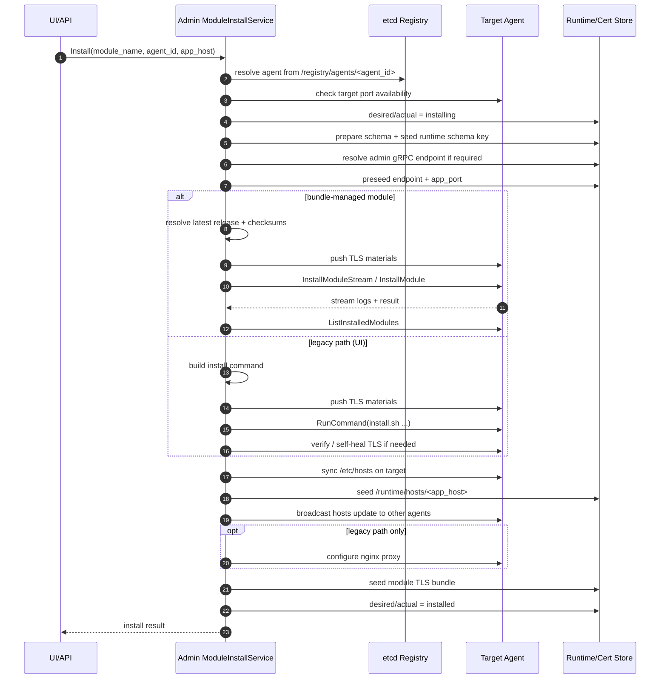
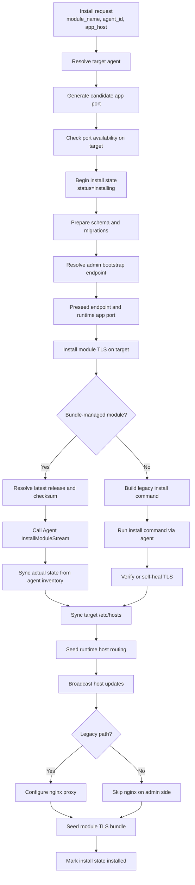
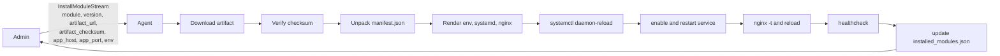

# Architecture

## Role

`aurora-admin` là control plane:

- quản lý runtime config
- cấp cert/bootstrap cho agent
- điều phối module install metadata
- expose UI + API cho vận hành

## Main Components

- `cmd/server`: entrypoint.
- `internal/app`: wiring, route, middleware.
- `internal/service`: business/service layer.
- `internal/repository`: etcd/cert-store abstraction.
- `internal/transport/http`: admin APIs.
- `internal/transport/grpc`: runtime bootstrap + agent RPC.
- `src`: React/Vite UI (embed vào binary).

## Security Model (current)

- Admin edge TLS và Agent mTLS CA tách riêng.
- Agent enroll bằng bootstrap token + CSR.
- Sau enroll, agent dùng mTLS.
- Identity nằm trong cert SAN claim (node/service/role/cluster).
- Runtime authz theo role ACL ở gRPC layer.

## Discovery

- Agent presence lưu trong etcd theo lease TTL tại `/registry/agents/<agent_id>`.
- Admin list/resolve live agent từ registry (không phụ thuộc `/etc/hosts` cho nội bộ control-plane).

## Installer Direction

- Kiến trúc installer thế hệ tiếp theo được chốt ở [AURORA_INSTALLER_PHASE0.md](/home/phucle/Desktop/project/AURORA_INSTALLER_PHASE0.md).
- Roadmap production-grade được chốt ở [AURORA_INSTALLER_PRODUCTION_GRADE.md](/home/phucle/Desktop/project/AURORA_INSTALLER_PRODUCTION_GRADE.md).
- Hướng đi chính:
  - artifact chuẩn hóa
  - installer engine nằm trong agent
  - Admin chỉ orchestration

## Service Install Flow

Hiện tại flow install service trên `aurora-admin` là:

- Input công khai từ UI/API chỉ còn:
  - `module_name`
  - `agent_id`
  - `app_host`
- Runtime install luôn cố định là `linux-systemd`.
- `ums`, `platform`, `paas`, `dbaas` đi theo bundle install qua agent.
- `ui` vẫn còn đi theo legacy install script.

### Sequence

### Orchestration Graph

### Agent Bundle Path

`Admin` không còn cài trực tiếp binary/service cho các module bundle-managed. Thay vào đó:

### State Model

Install state hiện dùng vocabulary chung giữa `desired`, `actual`, và agent inventory:

- `installing`
- `installed`
- `failed`
- `missing`
- `agent-unreachable`
- `unknown`

## Startup Flow

1. Load env config.
2. Bootstrap runtime keys vào etcd nếu thiếu.
3. Reload runtime config từ etcd.
4. Build services + transports.
5. Start HTTP server và gRPC endpoints.
